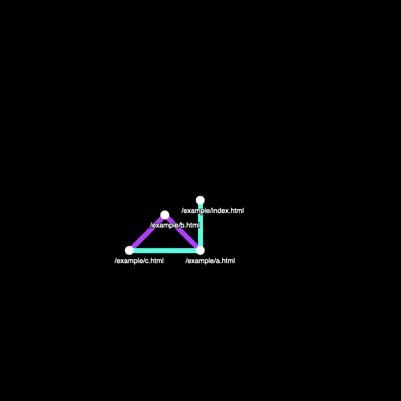

# hyperlink-transit-map

0 dependencies, vanilla Javascript site crawler and visualizer.

Inspired by [Public Transit Neocities](https://publictransit.neocities.org/map)

Work in progress:

## Todo

-   [x] No two nodes can share the same position
    -   [x] Naive approach; keeps drawing a random adjacent point and checks if it's taken. Won't work if all 8 adjacent positions are already taken and will result in infinite recursion.
        -   [ ] there seems to be an off by one error in the math.. needs work
-   [ ] Avoid loops; e.g. following links back to nodes that have already been explored
-   [ ] Don't follow external links (start origin)
