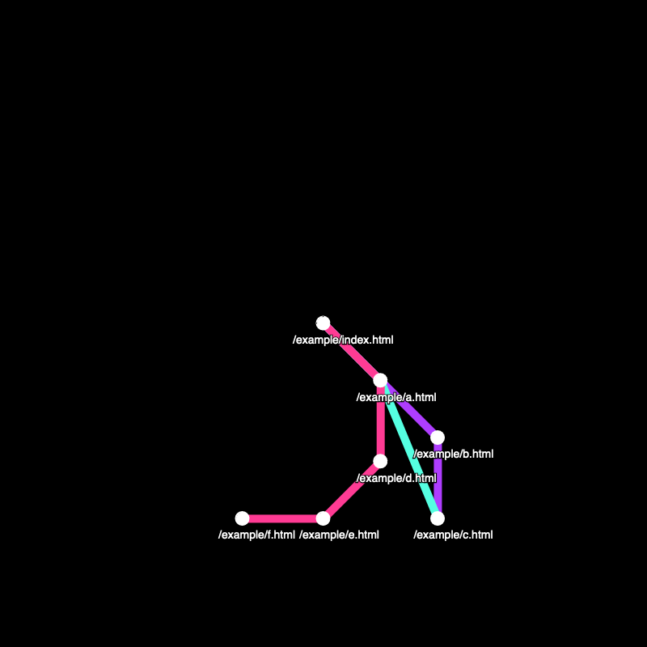

# hyperlink-transit-map

0 dependencies, vanilla Javascript site crawler and visualizer.

Work in progress:

## Todo

-   No two nodes can share the same position
-   Avoid loops; e.g. following links back to nodes that have already been explored
-   Don't follow external links (start origin)
